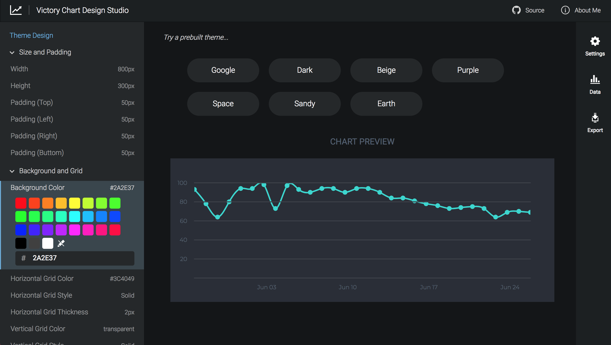

# Victory Chart Design Studio

Adding a simple chart to a website is surprising difficult to do. It involves a deep understanding of D3.js and various SVG attributes. 

I built a web application that makes it easy to design charts and add them to your website (assuming you're using React).

Check out the [demo](https://narinluangrath.github.io/victory-gui/).

